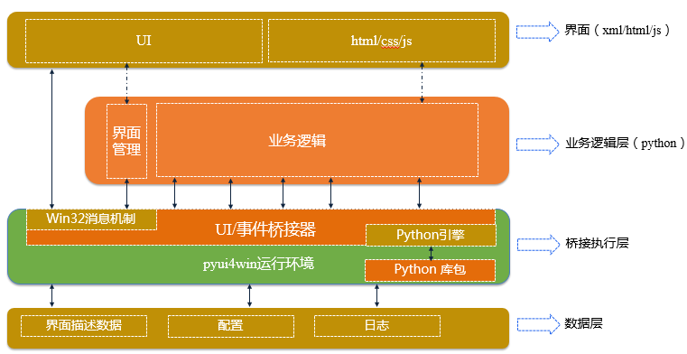
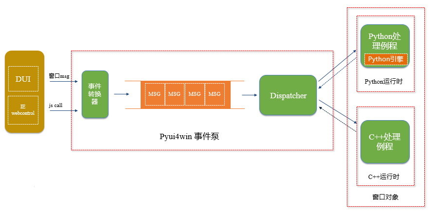
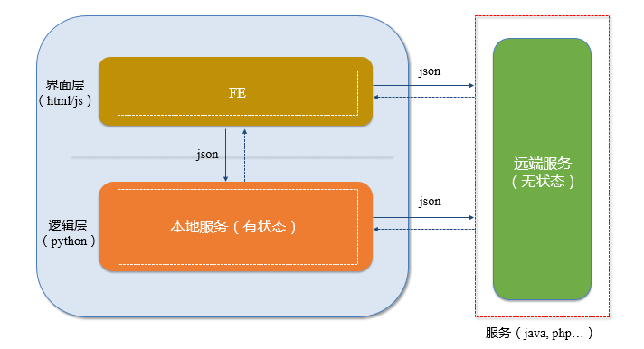

pyui4win
========

一个用python实现业务逻辑、用xml和html/css/js描述界面的windows程序的快速开发框架

# 应用框架

1、pyui4win根据xml/html/js/css创建界面

2、Pyui4win接收用户的操作事件，并选择该事件对应的python处理例程

3、将该例程放在内嵌python引擎中执行

4、Pyui4win将处理结果展示给用户

# 桥接器原理

1、界面事件和执行器发送过来的消息经过pyui4win运行环境转为pyui4win消息队列中的事件

2、事件分发器从消息队列中获取消息，并根据消息分类派发相应的处理例程

3、如果有对应的python例程处理，那么由python例程处理。否则由C++例程处理

在项目实践中，只需要实现python业务逻辑例程即可

# 最佳实践
在实践中，发现用html/css/js来实现界面层展现更快更酷炫，而且这样界面层和业务层逻辑更清晰。所以推荐html/css/js写界面逻辑，python实现业务逻辑。

1、本地服务为fe提供有状态会话

2、远端服务为fe提供无状态会话

3、Fe与本地和远端服务交互，实现流程编排，完成业务功能

4、交互采用json格式消息

js和python约定采用json格式来调用。fe暴露一个JsFun4Py函数，供python调用。该函数是js接收python请求的总控制器

python调用js例程：

        msg = {
            'fun': "func1",
            'content': {
                'flag': 'vvvvvvvv'
            }
        }
        self.Browser.CallJs(id(msg))
        
其中Browser是界面中的ie webbrowser控件，CallJs是pyui4win框架对该控件的方法。

js调用python例程，并获取json格式结果：

        var dd = window.external.InvokePyFun("{\"fun\": \"xxx\", \"param1\": \"yyyyy\", \"param2\":\"zzzzzzzzz\"}")

与js相同，python中也存在一个处理js请求的总控制器消息WM_FROM_JS：

    class MainFrame(PyFrameBase):
        def HandleCustomMessageInternal(self, uMsg, wParam, lParam):
            if uMsg == WM_FROM_JS:
                return self._HandleCommandFromJs(wParam)
                    
            
        def _HandleCommandFromJs(self, wParam):
            params = PyWinUtils().Conver2string(wParam)
            paramsjson = json.loads(params.decode('gbk'))
            if paramsjson['fun'] == "xxxx":
            
# 简单界面实践
除了最佳实践，也可以用界面设计器直接配置界面。界面设计器会自动生成界面处理框架代码

# 注意事项
请不要用ctype方式调用windows messagebox对话框或者其他标准对话框，需要时可以使用pyui4win里面已经封装好的标准对话框，或者自己在pyui4win中做扩展。用ctype调用其它的api都没有问题。至于原因，还没有时间研究，猜测是与duilib的实现方式和ctype的实现方式有关系。期待对这个问题有研究的同学可以告诉我 :)

# vs electron
electron是一个非常有名的框架。采用该框架，界面逻辑和业务逻辑都可以采用js开发。它有非常成功的案例。由于客户端程序的复杂性，electron要求开发人员不仅是专业的js开发人员，而且还需要多种其他技能，比如多线程，同步等等rd同学的技能。如果团队中有这样高水平的fe同学，可以考虑electron。pyui4win应用框架采用的界面层和业务逻辑层分离的方式，降低了系统复杂度，这也相应降低了对开发人员的技能要求。如何选择，需要根据研发团队的水平和开发投入综合决定。

# vs cefpython
CEFPython 是 CEF 的 Python 绑定实现。但是莫名的崩溃是一个还是open中的问题，所以，我会拿它来做一些自己的一些工具。但是商业化的产品，我想还是暂时不要冒这个风险

